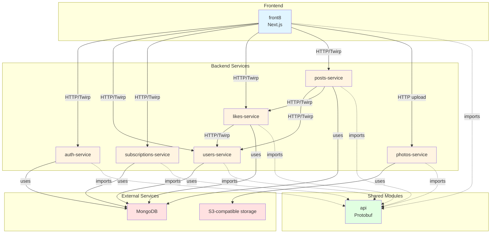

# Service Dependency Graph

This document describes the dependencies between services in the meme9 project.

## Visual Dependency Diagram



**Legend:**
- Solid arrows (→) = HTTP calls (Twirp or custom)
- Dotted arrows (-.->) = Context/indirect dependencies or imports

## Overview

The meme9 project consists of:
- **Frontend**: Next.js application (front8)
- **Backend Services**: 6 microservices written in Go
- **Shared**: Protobuf API definitions
- **External**: MongoDB and S3-compatible object storage

## Service Dependencies

### Service-to-Service Dependencies

```
front8 (Frontend)
├── auth-service
├── users-service
├── subscriptions-service
├── likes-service
├── posts-service
└── photos-service

posts-service
├── users-service (for user info in posts)
└── likes-service (for likes count and status)

likes-service
└── users-service (for user info in GetLikers)

users-service
└── (no service dependencies)

subscriptions-service
└── (no service dependencies)

photos-service
└── (no service dependencies - reads x-user-id header from frontend)

auth-service
└── (no service dependencies)
```

## Detailed Dependency Matrix

| Service | Depends On | Communication Method | Purpose |
|---------|-----------|---------------------|---------|
| **front8** | auth-service | HTTP/Twirp | Authentication (login, register, verify token) |
| | users-service | HTTP/Twirp | User profiles, avatars |
| | subscriptions-service | HTTP/Twirp | Follow/unfollow users |
| | likes-service | HTTP/Twirp | Like/unlike posts, get likers |
| | posts-service | HTTP/Twirp | Create posts, get feed, get posts |
| | photos-service | HTTP upload | Upload avatars |
| **posts-service** | users-service | HTTP/Twirp | Get user info (username, avatar) for posts |
| | likes-service | HTTP/Twirp | Get likes count and liked status for posts |
| **likes-service** | users-service | HTTP/Twirp | Get user info (username, avatar) for likers list |
| **users-service** | - | - | No service dependencies (reads x-user-id header from frontend) |
| **subscriptions-service** | - | - | No service dependencies (reads x-user-id header from frontend) |
| **photos-service** | - | - | No service dependencies (reads x-user-id header from frontend) |
| **auth-service** | - | - | Base service with no dependencies |

## External Dependencies

| Service | External Dependencies | Purpose |
|---------|----------------------|---------|
| auth-service | MongoDB | Store users and tokens |
| users-service | MongoDB | Store user data |
| subscriptions-service | MongoDB | Store subscription relationships |
| likes-service | MongoDB | Store likes data |
| posts-service | MongoDB | Store posts |
| photos-service | S3-compatible storage (Selectel) | Store uploaded images |

## Shared Dependencies

All services depend on the shared **api** module which contains:
- Protobuf definitions (`.proto` files)
- Generated Go code (`.pb.go` and `.twirp.go` files)
- TypeScript/JavaScript client code

## Port Assignments

| Service | Port | Protocol |
|---------|------|----------|
| auth-service | 8081 | HTTP/Twirp |
| users-service | 8082 | HTTP/Twirp |
| subscriptions-service | 8083 | HTTP/Twirp |
| likes-service | 8084 | HTTP/Twirp |
| posts-service | 8085 | HTTP/Twirp |
| photos-service | 8086 | HTTP (upload endpoint + Twirp service) |

## Dependency Flow

### Authentication Flow
1. User authenticates via `front8` → `auth-service`
2. `auth-service` returns token
3. `front8` verifies token with `auth-service` (server-side) and sets `x-user-id` header
4. `front8` includes token and `x-user-id` header in requests to other services
5. All backend services (posts, likes, users, subscriptions, photos) read `x-user-id` from header (no direct auth-service call)

### Data Flow Examples

**Post Creation:**
```
front8 → posts-service → (stores post in MongoDB)
```

**Post Retrieval:**
```
front8 → posts-service → users-service (get user info)
                      → likes-service (get likes count/status)
```

**Like a Post:**
```
front8 → likes-service → (stores like in MongoDB)
```

**Get Likers:**
```
front8 → likes-service → users-service (get user details for each liker)
```

**Upload Avatar:**
```
front8 → photos-service (upload endpoint) → (processes and uploads to S3-compatible storage)
front8 → users-service (SetAvatar with returned URL)
```

## Notes

- All services use **Twirp** (RPC framework) for inter-service communication
- `photos-service` also exposes a custom HTTP upload endpoint; its Twirp `GenerateUploadUrl` is disabled
- Authentication is handled via Bearer tokens passed in the `Authorization` header
- Server-side requests from `front8` verify tokens with `auth-service` and set `x-user-id` header
- All backend services (posts, likes, users, subscriptions, photos) **do not directly call auth-service** - they trust the `x-user-id` header set by the frontend
- Most services use MongoDB for persistence
- `photos-service` uses S3-compatible object storage (Selectel) for image storage
- The `api` module is shared across all services and contains the contract definitions
